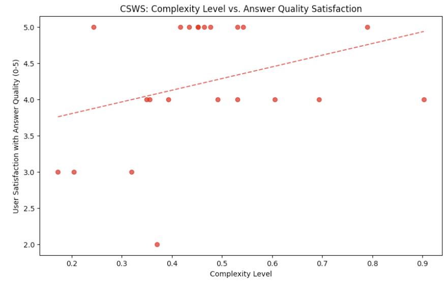
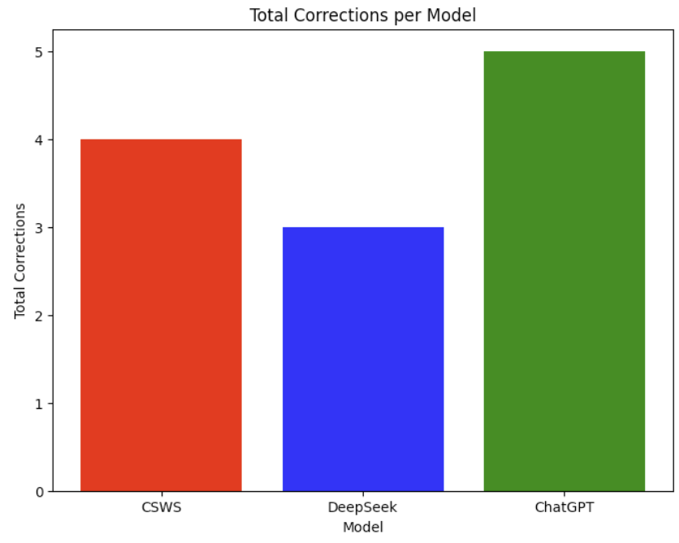
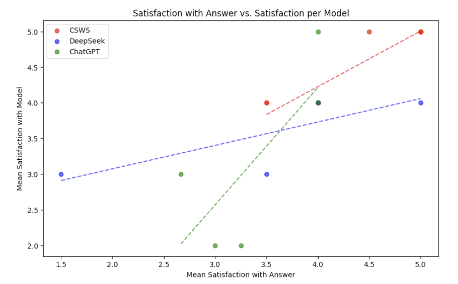
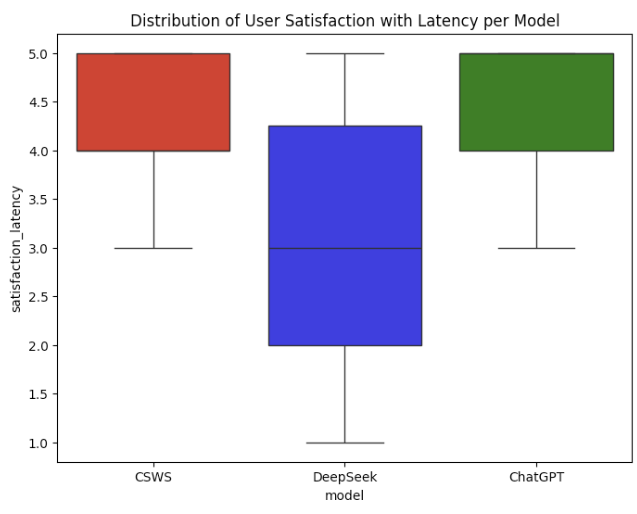
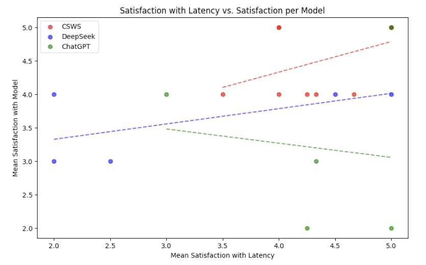

# Evaluation Core Assignment

## Conducting user evaluation [+5]
**Your goal is to assess the usability of your system.**
**[+5] Evaluate your system with at least 10 participants. Write and submit 0.5-1p of notes for each participant.** 

***Individual 1***
CSWS → ChatGPT-4o

As in original study, the individual’s selected task was the generation of study questions and resources for the MCAT. This user identifies as the ‘Google-2.0er’ persona.

CSWS: The first query was the generation of a practice problem for oxidation reaction. The participant had already previously reacted negatively to the thinking process of the reasoning models, and she expressed a similar opinion of ‘information overload’ during the initial response to her query. However, in contrast to DeepSeek, the participant witnessed much more directness and concision to CSWS’s thoughts which was appreciated. They ended up following up on the question to check correctness, and they were very satisfied with the answer.

GPT-4o: Started with the same query, and the generated practice problem lacked the amount of ‘reasoning’ for why the question was a good practice problem. User indicated approval of this, as their use cases are very utilitarian. Response quality was identical for first query. The follow up ‘give me the answer query’ was wrong in terms of adding charges, and corrections failed to yield actual convergence on answer. 

**“How did you feel about the quality of our model’s responses relative to [the other model]?”**
Liked accuracy of the CSWS more. When model was asked to check answer again, was very clear and explicit and most importantly correct in its evaluation. Doesn’t really like the thinking process, but believes it may contribute to the accuracy of the responses. Like this much better than DeepSeek because of the relative succinctness and low-latency of ChatGPT. Accepts thinking if it benefits accuracy of responses. Never knows if the answer from ChatGPT is correct or not, so appreciate

**“Did you feel that the detail and depth of these responses was appropriate for your needs?”**
Thought it was fine. Both models were able to generate competitive responses; found some redundancy in the coverage of CSWS’s thinking.

**“Did you feel that the length of these responses, including the thinking processes, was appropriate/helpful for completing your chosen task?”**
Fine, mostly because she’s comparing the thought process to their memories of DeepSeek. Thought Process was very succinct and also presented in a digestable, parseable format; however, she still believes there’s major issues with the information density presented in the thought format,.

**“In regards to the innovations of our model, you may have noticed metrics such as the “complexity level” of your questions. Did you notice any difference in thinking length or answer verbosity as this complexity level increased/decreased?”**
Didn’t pay specific attention to complexity level → answer depth relation. Did believe that the CSWS answers were more depthy as a whole, but with a limited sample of queries, she doesn’t have a very concrete opinion as of yet

**“Did you feel that the level of thought provided was appropriate and/or helpful for the completion of your workflow?”**
She believed there was some level of redundancy in the thought process, but if the thought process was requisite to the strength of the answer, she was willing to accept a concise set of thoughts to obtain a correct answer.

***Individual 2***
DeepSeek → CSWS

This individual, in contrast to the original study, used the models to finish their physics homework. This user identifies as the “LLM as Oracle” persona.

The first model trialed was DeepSeek, which the user previously had exposure to. The user ended up spending several minutes waiting for DeepSeek to finish deliberating, and noticed that DeepSeek was repetitively and circularly deliberating sig figs on the response. While the answer was completely correct, the user noted that the latency was absurd, and almost made the model prohibitively slow to use. Furthermore, the user conducted a conversation with me during the duration of the thinking time, signalling a complete disinterest in the thinking process after a certain duration.

The second model trialed was CSWS; the user previously had experience with Claude. The user was able to very quickly obtain the correct answer as well from CSWS with minimal latency, which the user approved great approval of. The user also tried another physics homework problem to which they were also able to obtain a correct result. The user looked briefly through the thinking process of the first query, and noted that the model did not get stuck in the repetitive deliberation of sig figs (and was perhaps less ‘exact’ than DeepSeek as a result), which the user approved of.

**“How did you feel about the quality of our model’s responses relative to [the other model]?”**
All (I) want is an answer; both models were able to deliver an answer of the same quality, which was purely just a correct answer. However, in regards to latency, the time it took DeepSeek to run was simply much worse that it actively impacted the perception of the answer quality.

**“Did you feel that the detail and depth of these responses was appropriate for your needs?”**
Yes, in general. There was only one slight point of contention where a multiple choice question without multiple choice answers provided in prompt did require some effort to parse by CSWS, but this was less of an issue by the model and more of an issue of the prompt provided.

**Did you feel that the length of these responses, including the thinking processes, was appropriate/helpful for completing your chosen task?”**
Completely fine. The concision by CSWS was appropriate and direct, and the thinking processes when compared to DeepSeek were especially brief and legible. Length was perfect in this regard.

**“In regards to the innovations of our model, you may have noticed metrics such as the “complexity level” of your questions. Did you notice any difference in thinking length or answer verbosity as this complexity level increased/decreased?”**
The user didn’t really pay attention to the complexity levels, but they did appreciate how the thinking was very concise and appropriately suited for the problems provided. 

**“Did you feel that the level of thought provided was appropriate and/or helpful for the completion of your workflow?”**
The user expressed how the complexity level heuristics felt fine, because even if the user didn’t pay attention to them, they fulfilled the intuition of limiting the ‘upper limit of thought required’. In comparison to DeepSeek, which might have been a biased/extreme point of comparison, the limited thought provided by CSWS for the physics problem use cases was very much appreciated for the purposes of getting the work done (as well as having some minimum basis for reproducing the answer).

***Individual 3***
ChatGPT → CSWS

This individual is a new individual, and from the evaluation, seems to be a “LLM as Intern” persona.

The user initially began with ChatGPT, and posed to it an open-ended coding prompt that had no great solution due to the realities of the problem space. Individual gave up on line of questioning for ChatGPT, and instead asked it to consider the mechanisms with which to enable a scraping task, with which ChatGPT was able to provide a succinct, if not completely correct answer. The user did not seem too impressed.

The user moved on to CSWS, and posed to it the same initial open-ended coding prompt. This time, the user was more encouraged by CSWS proactively providing code to solve the issue. Upon reading it closely however, the user noticed hallucinations which he attempted to address in follow-ups. Ultimately, the user gives up on the line of questioning, but notes that CSWS was able to provide more insights into the problem space even without explicit questioning.

**“How did you feel about the quality of our model’s responses relative to [the other model]?”**
User believes that CSWS provides more comprehensive answers, e.g. considerations, etc. The initial answer was able to incorporate more considerations, e.g. agent rotations to avoid bot detection. CSWS hallucinated multiple times, but the user believed that the CSWS model was still closer to the correct answer than ChatGPT, though the comparison 

**“Did you feel that the detail and depth of these responses was appropriate for your needs?”**
Yes; especially because Claude is a more programming-focused model, the user believed that the comprehensiveness of the answer will naturally be better simply because the domain space is narrowed with such a model. (However, the user makes no explicit link to the reasoning process of the model, which may be due to not having DeepSeek as a point of comparison).

**Did you feel that the length of these responses, including the thinking processes, was appropriate/helpful for completing your chosen task?”**
Yes; the user believes the thinking is more verbose than is actually required. User prefers thinking come after the answer since thinking is ultimately a validator (which aligns with some project ideas we’ve had). Length is fine because he is not familiar with the domain of application, so more information is helpful, but frontloading this information instead of opt-inning this information is a bit troublesome, and reduces the readability of these models.

**“In regards to the innovations of our model, you may have noticed metrics such as the “complexity level” of your questions. Did you notice any difference in thinking length or answer verbosity as this complexity level increased/decreased?”**
The user noticed some deviations in metrics as he queried across the CSWS trial run, but ultimately the user was not paying full attention in drawing the causal links between answer quality and query complexity.

**“Did you feel that the level of thought provided was appropriate and/or helpful for the completion of your workflow?”**
The user says that the answer given by CSWS was at the level of a college student, perhaps an intern. However, he inherently doesn’t trust something that is capable of hallucinating as much as he saw, which he states is a problem across all LLMs. Simpler questions he thinks is appropriate are more of his typical use case for LLMs, but this model and its thoughts aren’t convincing enough to convince him that it can replace the guidance of a specialist or experienced engineer.

***Individual 4***
CSWS → DeepSeek

This individual is a original user from the user research phase who identifies with the “LLM as Oracle” persona.

The user ran an initial test workflow on CSWS, but then restarted to pivot onto a different workflow of asking theoretical lecture questions. Lecture questions in CSWS generally hovered around 0.45. Initial query caused user to express approval at the response to a more theoretical question, wherein the LLM was able to explain exactly why something wasn’t applicable to a problem and was able to extend its answer to other domains. Follow ups of a theoretical, followed by an application-based query, were both met with approval: with the former including a comprehensive logical background in its response,  and the latter confirming original intuitions and extending them further. User seemed engaged and approved of model throught evaluation.

The user than ran the exact workflow on DeepSeek. The initial query caused user to express heavy disapproval with the latency associated with “DeepYap”. Doesn’t know why the thinking process is just listing out equations and repetitively circling around. “It’s just not getting to the point.” Felt like the amount of thought it provided didn’t even correlate with the profoundness or depth of the answer. Follow -ps (that were the same as CSWS) also had relatively longer wait times, but were dramatically shorter than that of the first query. Notably, the second query had DeepSeek reveal a piece of insight than CSWS did not provide, which the user heavily approved of; however, the latency was a repeated pain point for the user.

**“How did you feel about the quality of our model’s responses relative to [the other model]?”**
CSDubz took the dub this time. DeepSeek was far too verbose in its thoughts, and provided very little insight in its thoughts while just repetitively regurgitating equations without context. CSDubz wasn’t too much better in that regard, but was able to arrive at the same general conclusions without the need for such verbose thoughts.

**“Did you feel that the detail and depth of these responses was appropriate for your needs?”**
Both CSWS and DeepSeek were both pretty surface level in the beginning. CSWS was able to understand that the questions became gradually more complex, and the user was able to see that the actual output reflected that perception of complexity, which the user liked.

**Did you feel that the length of these responses, including the thinking processes, was appropriate/helpful for completing your chosen task?”**
Thought the length was okay; not too long or too short, especially compared to DeepSeek. Felt that the questions he posed were relatively basic, so he feels like the length was a good fit for that level of complexity.

**“In regards to the innovations of our model, you may have noticed metrics such as the “complexity level” of your questions. Did you notice any difference in thinking length or answer verbosity as this complexity level increased/decreased?”**
User trial ran the project before, and initially expressed disapproval at answers at 0.15 complexity rating, citing a lack of depth as the key reason for these responses being worse than even that of ChatGPT. In the new run where answers came at around .45 complexity, the user expresses much higher approval.

**“Did you feel that the level of thought provided was appropriate and/or helpful for the completion of your workflow?”**
Yes, the level of thought was appropriate.  It didn’t go above or beyond; the user has some recollection of reasoning models going above and beyond in terms of providing insight. DeepSeek was able to provide a more insightful answer for one of the queries; However, for the purposes of completing workflow. CSWS’ thought complexity was appropriate, if not extraordinary.

***Individual 5***
creative generation task
CSWS and then ChatGPT 4o

For the first, less complex, task (design for dnd character), the responses were comparable, but there was a detail or two in ChatGPT’s description that implied a lesser knowledge of the fantasy creature (cheekbones on a bird). 
For the second task (magic system based on advanced areas of math), CSWS’ responses indicated an understanding of the material and applied it in creative ways. ChatGPT seemed to have only a rough idea and then overlaid simple magic concepts over the topics, required additional prompting for a better idea and quality was still lesser.

**How did you feel about the quality of our model’s responses relative to ChatGPT?**
-Liked the quality of CSWS' much more, a lot closer to what he wanted, overall experience was better, wait time felt appropriate given the level of quality in the response

**Did you feel that the detail and depth of these responses was appropriate for your needs?**
- "yes definitely", quite surprising how in depth it was, very detailed and interesting

**Did you feel that the length of these responses, including the thinking processes, was appropriate/helpful for completing your chosen task?**
- Yeah, the length of the thinking process was appropriate, likes seeing the thinking process and got what he was hoping to get out of it

**In regards to the innovations of our model, you may have noticed metrics such as the “complexity level” of your questions. Did you notice any difference in thinking length or answer verbosity as this complexity level increased/decreased?**
- Complexity didn't vary too much, but the second one (higher complexity score by .06) felt more verbose (not in a bad way) but it could have been due to the amount the model had to say about the question, not necessarily hitting the limit

**Did you feel that the level of thought provided was appropriate and/or helpful for the completion of your workflow?**
- definitely, a lot more in depth and pleasantly so. found himself looking at the thinking portion just as much as the actual response

***Individual 6***
decoding/determine if contents are malicious
first DeepSeek and then CSWS
gave up on deepseek, CSWS got it right after a slight correction and additional prompting since it’s not agentic.

**How did you feel about the quality of our model’s responses relative to DeepSeek?**
-the initial response was of similar quality but took MUCH less time to get there, easier to ask ours more questions since she didn't have to wait too long, maybe could've pushed deepseek but that would be a lot of time prob

**Did you feel that the detail and depth of these responses was appropriate for your needs?**
-DeepSeek: the chain of thought seemed like it was on the right track at first but it couldn't figure it out, multi step process so it needed to be broken up, couldn't get past initial step
-CSWS: had to split into multiple steps/queries, but responses were of satisfactory quality
-For both, because she had domain knowledge, she was able to have the appropriate guiding questions, but without that, would have been stuck at the first hurdle/query since they were both initially wrong

**Did you feel that the length of these responses, including the thinking processes, was appropriate/helpful for completing your chosen task?**
-DeepSeek: WAYYYYYY too long, lots of circling back, had some nice content at first but it kept doubling back "what if...". guided response had much less thinking and was more reasonable
-CSWS: generally better, first response blows deepseek out of the water in regard of time, though they came to the same conclusion

**In regards to the innovations of our model, you may have noticed metrics such as the “complexity level” of your questions. Did you notice any difference in thinking length or answer verbosity as this complexity level increased/decreased?**
-Seems decently correlated, makes sense first one was most complex because high complexity and had least complexity.

**Did you feel that the level of thought provided was appropriate and/or helpful for the completion of your workflow?**
-Yes, not too much, not too little.

**We had you try out DeepSeek, which is another example of a reasoning model that tends towards being very verbose in its thoughts. How would you compare the thinking you saw on DeepSeek versus the thinking you saw with our model?**

DeepSeek’s thinking doubled back in what felt like an unnecessary manner super often and consequently, it took seven minutes to get an incorrect answer. Individual 6 got bored quickly and only checked in periodically with wavering faith in the model’s ability. CSWS’ thinking was succinct and although it arrived at a similarly wrong conclusion, a correction was able to get it onto the right track, which Individual 6 was more inclined to do since they didn’t have to wait seven minutes.

***Individual 7***
ChatGPT 4o and then CSWS
legal defense for a dragon's crimes
NOTE: accidentally submitted CSWS form early, submitted second form for follow-up query

Both achieved a satisfactory response, but ChatGPT’s was better. It seemed like for CSWS, the second query (elaborate more) hit the lower thinking limit (or at least thought less) and then generated a longer final response, as requested.

**How did you feel about the quality of our model’s responses relative to ChatGPT?**
- quality wise ChatGPT was a little bit better, it seemed to understand the connotation of a legal tone better, whereas CSWS' was not as serious, though both were funny. Quality was relatively close, CSWS was just worse

**Did you feel that the detail and depth of these responses was appropriate for your needs?**
- Yeah, after correction. Pre-correction was lacking in detail.

**Did you feel that the length of these responses, including the thinking processes, was appropriate/helpful for completing your chosen task?**
- yeah I think so, it didn't feel like a long time or anything

**In regards to the innovations of our model, you may have noticed metrics such as the “complexity level” of your questions. Did you notice any difference in thinking length or answer verbosity as this complexity level increased/decreased?**
- I was surprised that the "less complex" one took a similar time for the thinking (not really noticeable). 

**Did you feel that the level of thought provided was appropriate and/or helpful for the completion of your workflow?**
- Yeah seeing the thinking was very helpful. It explained the thinking process very well and was more readable than ChatGPT's.

***Individual 8***
Context: originally used CSWS/ChatGPT to help with RL homework problems. This time, working on estimating nutrition macros from a list of foods he ate during the week. CSWS was better overall, giving a more satisfactory response after a single interaction, while ChatGPT required redirection.

gpt-4o and then CSWS

**How did you feel about the quality of our model’s responses relative to ChatGPT?**
CSWS was better, since it estimated my macros much closer to my own personal estimate in my spreadsheet. It also didn’t hallucinate by adding foods that I didn’t consume to the calculation. I needed to redirect ChatGPT in order to get a better estimate. I also liked the overall vibe of CSWS better, since the follow up interaction I had with it built confidence that it could accurately estimate my nutrition.

**Did you feel that the detail and depth of these responses was appropriate for your needs?**
Yes. I don’t think I need to know the entire reasoning process every time, but it was helpful in this case to expose some rationale (CSWS even added some “?”’s behind statements in the reasoning that were assumptions). 

**Did you feel that the length of these responses, including the thinking processes, was appropriate/helpful for completing your chosen task?**
I think so. Since I had my own estimates anyways, I didn’t need too much background information to sanity check either’s responses.

**In regards to the innovations of our model, you may have noticed metrics such as the “complexity level” of your questions. Did you notice any difference in thinking length or answer verbosity as this complexity level increased/decreased?**
Definitely. ChatGPT was way more eager to give the shortest possible response than CSWS. Although I’m used to having to go back and forth with the bot, CSWS had more depth than ChatGPT when appropriate.

**Did you feel that the level of thought provided was appropriate and/or helpful for the completion of your workflow?**
Like I said earlier, I didn’t need the reasoning too much for this task due to having my own macro estimates for comparison. However, the fact that there was some uncertainty evaluation in the process of breaking down my weekly diet was assuring. I don’t think ChatGPT exposes that type of reasoning, even when you have that mode on.

***Individual 9***
DeepSeek and then CSWS
Context: Writing an email to masters thesis committee members to update them on progress and primarily to schedule meetings prior to a defense in the next coming months.

**How did you feel about the quality of our model’s responses relative to DeepSeek?** 
Deepseek started off with an overly formal tone which, while taking about the same amount of time to finish, didn’t reflect the larger latency. CSWS had a better tone, and seemed to overthink less about how baroque it needed to be when addressing academic supervisors.

**Did you feel that the detail and depth of these responses was appropriate for your needs?**
Generally speaking, yes. The DeepSeek response was probably over-detailed, since there was the thinking, the draft email, and then further notes/reminders to replace the placeholders. For CSWS, the depth and detail 

**Did you feel that the length of these responses, including the thinking processes, was appropriate/helpful for completing your chosen task?**
The response from CSWS was a good sweet spot, since it wasn’t too verbose or winding and led to a satisfactory response pretty much the first try. DeepSeek took almost 3x as long to correct the original email after I gave it feedback about the time tone being too formal despite the changes required being relatively simple.

**In regards to the innovations of our model, you may have noticed metrics such as the “complexity level” of your questions. Did you notice any difference in thinking length or answer verbosity as this complexity level increased/decreased?**
I think the visual gauges and emojis were a nice touch since it made it clear how long to expect the response to be and to take (time wise). With DeepSeek, there’s no telling how long it’s going to take to get to the final answer. The thinking process is more entertaining when the model changes its mind, but it’s not necessarily more helpful.

**Did you feel that the level of thought provided was appropriate and/or helpful for the completion of your workflow?**
Probably not relevant, since email drafting isn’t the most complicated task in the world 

***Individual 10***
CSWS and then DeepSeek 

**How did you feel about the quality of our model’s responses relative to DeepSeek?** 
I felt like the responses of your model were not as complex or intricate as the responses I got from DeepSeek. At the very least, DeepSeek’s response was more verbose, and it also tried to include potential references to use (hallucinated). Since I am working on a paper, getting a lengthier response is more ideal in my circumstances.

**Did you feel that the detail and depth of these responses was appropriate for your needs?**
I feel like the depth of the content provided was not sufficient for my needs in writing a research paper. 

**Did you feel that the length of these responses, including the thinking processes, was appropriate/helpful for completing your chosen task?**
I was surprised that the thinking time was noticeably longer than that of DeepSeek, but I still got a shorter response with less information than a competing model. In the same chat window, I repeated the same prompt with a greater complexity, and I got the exact same response. I appreciate the visibility of the complexity, but giving users some feedback of the total amount of complexity used as well would be a pretty cool feature.

**In regards to the innovations of our model, you may have noticed metrics such as the “complexity level” of your questions. Did you notice any difference in thinking length or answer verbosity as this complexity level increased/decreased?**
I noticed as I manually maxed out the complexity, the thinking time increased, but I still got the same response. So, it looks like the model used a more complicated approach to get to the same response.

**Did you feel that the level of thought provided was appropriate and/or helpful for the completion of your workflow?**
I think the level of thought was appropriate in my first response. Afterwards, I do not think the excessive manual thinking was necessary given that I received the same output. 

## After your evaluation [+4]
**[+4] Analyze your data and write up your key findings. The findings should be about 0.5-1p for each motivating question and any other interesting findings.**  

[Colab Notebook for Quantitative Analysis](https://colab.research.google.com/drive/1o-HZf76anSpjkHvD27fc_hV-Yt--enVg?usp=sharing)

The primary motivating question: how well does heuristically defining a token limit for thinking models correlate with improving user satisfaction with their LLM-usage experience? E.g., by providing a balance between latency and response quality/transparency, reducing iteration count, etc.

This question requires analysis of several aspects of our quantitative data: namely, user satisfaction with latency, response qualities, and their relationships to overall user satisfaction with each model. We analyze quantitative data gathered from 10 participants. From this data, we analyze this question from a couple viewpoints:

1. First, what is the relationship between the complexity level evaluated by our heuristic and the resultant user satisfaction with the answer?

User satisfaction with answer quality is consistently rated as 4-5 above complexity levels of 0.4, but is consistently lower at complexity levels below 0.35. We initially expected user satisfaction to remain high at all complexity levels, e.g. less complex prompts would also be rated as 4-5, and the polyfit would be flat as a result. However, we observe that user satisfactions at lower complexity levels do not uphold this assumption. 

However, model to model comparisons indicate that there is general answer quality improvement between CSWS and other models. For example, analysis of total ‘corrections’ per model indicates that CSWS results in a marginal improvement of required corrections, though this gap across 10 participants is too small to become conclusive data. See the following graph:

Furthermore, analysis of mean answer satisfaction ratings against mean model ratings confirms that CSWS generally upholds higher floor for both answer satisfaction and model satisfaction, further evidencing that our system improves user satisfaction via response quality. 

While the individual strength of the models themselves are definite confounders to whether our thought heuristic was the reason for improving user satisfaction with answers (e.g. Claude might be better at coding than GPT-4o), the first graph of complexity lvl vs. answer satisfaction indicates that there is likely a causal link between user satisfaction and the complexity rating as evaluated by our heuristic.

In terms of concrete takeaways and key findings: we find that in general, CSWS provides a higher floor for user satisfaction with response quality than its competitor models. In order to better answer the motivating question, we would need to tune the heuristic further, e.g. by providing a higher minimum ‘floor’ of thought for less-complex queries, or improving the heuristic to better evaluate the complexity of use cases. We would also compare CSWS against Claude 3.7-Sonnet in order to remove the confounder of individual model quality.  

If the floor for user satisfaction increases as a result of our heuristic changes and the ‘complexity vs. user answer quality satisfaction” trend becomes more flat, then we know that there is a definite causal link between our heuristic and the user’s quality of experience with our model. If the comparison with 3.7-Sonnet still allows our model to maintain a higher floor of satisfaction, then we know that there is definite value in heuristic tuning of thought budgets.

2. What is the relationship between evaluated latency and user satisfaction with each model?

As we observe in the graph above, CSWS provides a boxplotted satisfaction with latency essentially equivalent to that of ChatGPT, which is the model we selected to optimize for latency. While average latencies were indeed higher in that of CSWS, these latencies were not high enough to generally impact user perceptions of model quality.

When we observe at a more granular level by comparing each model’s satisfaction with latency vs. satisfaction with model, we observe the following findings:

- in general, mean satisfaction with latency significantly higher than that of DeepSeek’s, which validates our original intuition of capping thought budgets to cap latency.
- there is a correlation between latency and satisfaction per model, as indicated by both the positive trends of both DeepSeek’s and CSWS’s regression lines. While these trends may be conflated with that of answer quality trends, this does indicate that users value latency in terms of their model experience.
- the negative trend in ChatGPT’s regression validates our original intuition: that while low latency systems may indeed be a qualifier of efficiency for users, existing low-latency options may not deliver the answer quality that users require in order to make their workflows efficient.

Therefore, in terms of key findings from our quantitative analyses, we assert that there is a strong likelihood that user satisfaction is improved by our system via capping the thought budget of a reasoning model via heuristic. This improvement arrives by reducing the latency the user experiences waiting for a response, as evidenced by comparisons with DeepSeek, a model notorious for high-latency reasoning processes.

In terms of answer quality improvements, we cannot make any definite assertion at this time as to whether our heuristic capping of the thinking budget was responsible for noted increases in user perception of answer quality between CSWS and competitors. While there is strong evidence for the claim that our model provides higher quality answers as evaluated by our users when compared to both DeepSeek and ChatGPT, this evidence is confounded by the natively unequal performance between models; e.g. Claude being notably better than 4o at coding. We can make the claim that there is likely a relationship between our heuristic’s evaluated complexity level, its mapped thinking budget, and user satisfaction with our model’s responses due to the trend observed in the first graph. Further investigation is required to be certain.

In terms of key takeaways:
- Users generally indicated approval at the low latency of CSWS. This approval persisted even in comparisons against ChatGPT, and was noticeably and substantially better than that of DeepSeek.
    - Notably, users expressed how the concision of CSWS’s thinking far surpassed that of DeepSeek’s thinking, wherein the latter model had the tendency to loop around in its thoughts during higher complexity problems.
- Users generally approved of the depth and quality of CSWS’s responses in comparison to competitor models. There were several instances where CSWS failed to surpass competitors, e.g. 2 instances with DeepSeek and 1 instance with ChatGPT; however, there was only 1 case where this difference in response quality was sufficient to generate a lower rating.
- Users who paid attention to the complexity level generally observed a difference in response depth and length as complexity level increased. However, there was still some confusion and/or attention drawn to how complexity level (including manual configuration) didn’t always manifest in different answers or quality.
- Several users noted that the presentation of thinking information could be considered overwhelming or extraneous.

## Group Reflection [+1]
1. **What is one thing that went well in your evaluation?**
We were able to see our system work in the desired manner: it provided detailed answers in a reasonable amount of time, assuming that the questions were recognized as those that required ‘detail’. For simpler questions, the thinking portion didn’t drone on. And the answers, while not perfect, were generally of good detail. The most important contribution however was latency reduction, and we observed massive decreases in latency between our system and that of DeepSeek, the most applicable competitor system with a similar ‘baseline’ of thinking. We saw a correlation between this reduced latency and improved user satisfaction, which is an important validator of our original intuition.
2. **What is one thing that you wish you could have done differently?** 
It would have been more interesting and perhaps more informative to attempt evaluation with people with a fresh batch of participants, however this would lose the benefit of our in-users approach, e.g. our users already familiarity with the full spectrum of LLM experiences due to prior study participation (in our scenario: DeepSeek and ChatGPT). The people we asked who knew us had at least an unconscious bias towards our system when delivering feedback. Furthermore, given the time constraints of our subjects, many were stressed at the time commitment demanded by our evaluation, and may not have engaged with the model’s features as fully as they would have if the process was opt-in. While this is not necessarily something we can change, acquiring volunteers would provide much more curious, engaged subjects, which may have gleaned more insights into how the complexity scores impacted perception of answer quality.
3. **How, if at all, did your participants represent the personas you intended to design for?** 
While most users had individual quirks in how they engaged with LLMs and their presented information, all users were able to be categorized into the three personas we initially identified during user research. More cynical, deliberate users represented the ‘LLM-as-Intern’ interaction persona. More prevalent, however, were the ‘Google 2.0ers’ and ‘Oracle Seekers’ that operated under a broad level of high level of trust for the agent; these users would be characterized by a broad disinterest of the thinking process in the case of the former, and some level of curiosity into LLM thoughts as well as ‘one-shot ideation’ for the latter.
4. **How do you think this impacted your results?** 
Since we’re setting an upper bound in terms of thought processes, what sets CSWS apart in terms of features isn’t showcased as much with quick and easy (Google 2.0 Persona) queries like “what is the capital of California” or other queries that don’t require a deeper level of thinking. However, we are able to compare latencies across CSWS vs. DeepSeek and ChatGPT, and we’ve found that CSWS is able to form a competitive middle ground of latencies that adequately serve the needs of Google 2.0ers without becoming verbose to the point of obsession in the case of DeepSeek responses, even for relatively simple responses. This manifests in the shape of improved satisfaction levels when comparing DeepSeek v.s. CSWS; however, this also manifests in marginally reduced competitiveness when comparing satisfaction with latency between CSWS and ChatGPT.

In terms of other personas and the effect of their representation on our evaluation, we believe that their engagement is much less difficult to reckon with than ‘Google 2.0ers’. This is because the primary metric of their concern is answer quality, which we inherently attempt to optimize by working with parameterized thinking budget; considerations like transparency become tangential and supportive of the goal of answer quality, which allows our system much higher satisfaction ratings when this becomes a concern.
5. **Based on the above, what does this say about the potential applicability of your system?**
Our system seems most applicable for users seeking more involved responses/help with more complex tasks, while not wanting to endure the disquietingly long latency associated with DeepSeek and other potential reasoning models without a sort of ‘cap’. Since our original target user base was college students, our system seems like a good fit; college students generally have a vast variety of complex workflows, have some level of impatience that demands a shorter latency, and have a high concern with efficiency with a subordinate concern for transparency. All of these needs are served by our system. However, in terms of the Google 2.0er personality, there still may not be a sufficient niche for the ‘reasoning’ portion of our system to apply to. While we have evidence that CSWS provides stronger answers for even relatively straightforward prompts, this cannot be owed specifically to our system; for example, superior interactions could be powered by raw differences in model (Claude vs. ChatGPT), not necessarily that of the parameterized thinking budgets of our system..
6. **What new questions do you have based on your evaluation?** 
What is the psychological effect of being frontloaded a large volume of information that is related, but not necessarily directly related, to the answer that the user knows they’ll receive? Multiple users assert an ‘information overload’ from the thinking process, and so it may be viable to re-ask the viability of presenting a solution first before following up with the backing (thinking) for it. 

To what extent does visualizing the thinking actually matter to the user? In the original user research, users expressed interest and regard for DeepSeek because of its reasoning process. However, returning to these users now revealed that they now had much less interest in the reasoning processes of both our system and DeepSeek. While users used the reasoning process to extend the answer formally provided, glean new insight, or understand what the model was doing: a prevailing insight was that the reasoning process was tangential to the user’s main priority--getting a solution to what they wanted. This leads to multiple questions related to the presentation of the thinking of a model, but the first question to ask is how much its presence actually matters to the user.

## Did you use a generative AI tool for this assignment? If so, which tool(s) and how?

Used ChatGPT to generate polyfit regression line code and code cleaning for some graphical analysis of quantitative data. No other usage.

## How much time did you spend on this assignment as a group? Individually?
- Group: 8 hours
- Michael: 2 hours (worked on UI overhaul separately)
- Ken: 3 hours
- Matthew: 3 hours

